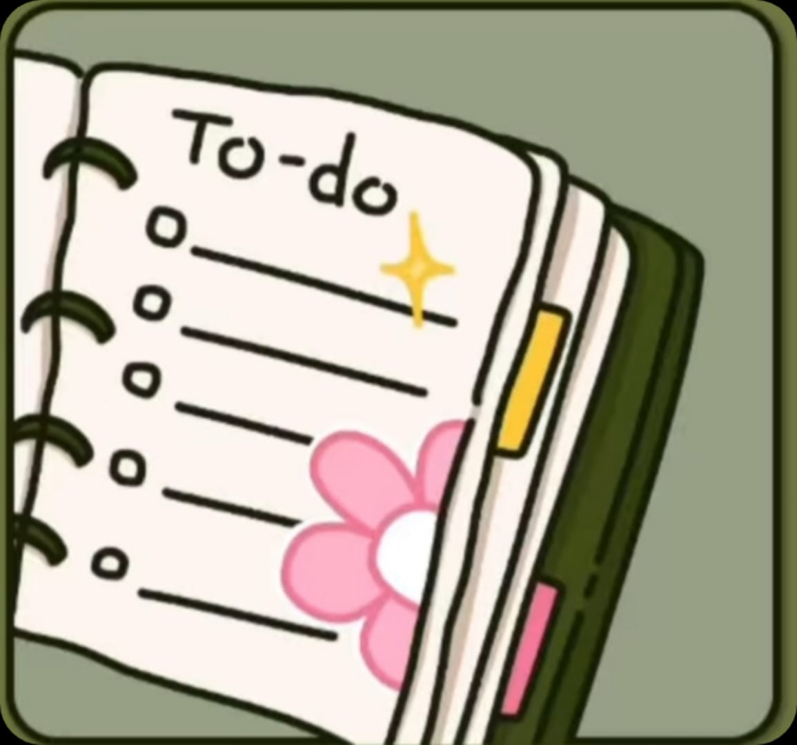

# 🎨 Green Productivity - To-Do list App

*Create stunning To-Do's with ease - right in your browser!*

  <h2>✨ Features</h2>
  <ul>
    <li>📝 Add unlimited tasks with custom names</li>
    <li>⏱️ Set a timer (in seconds) for each task</li>
    <li>✅ Mark task as completed with a checkbox</li>
    <li>🛑 Automatically stops timer when task is marked done</li>
    <li>📱 Fully responsive layout — perfect for mobile users</li>
    <li>🌿 Elegant green theme with custom fonts</li>
  </ul>

  <h2>🚀 Getting Started</h2>
  <ol>
    <li>Clone the repository:
      <pre><code>git clone https://github.com/Sourav-bhardwaj02/green-productivity.git</code></pre>
    </li>
    <li>Open <code>index.html</code> in your browser:
      <pre><code>cd green-productivity
open index.html</code></pre>
    </li>
  </ol>

  <h2>📱 How It Works</h2>
  <ol>
    <li>Click <strong>START</strong> on the intro screen</li>
    <li>Enter a task name and desired timer in seconds</li>
    <li>Click <strong>Add Task</strong> — it appears in your list</li>
    <li>Watch the countdown begin automatically</li>
    <li>Click the checkbox to mark task complete and stop the timer</li>
  </ol>

  <h2>🎯 Use Cases</h2>
  <ul>
    <li>⏳ Pomodoro-style task management</li>
    <li>🧘‍♂️ Mindful goal setting</li>
    <li>📋 Daily planning with a visual timer</li>
    <li>📱 Task organization on mobile</li>
  </ul>

  <h2>📂 Project Structure</h2>
  <pre><code>
green-productivity/
├── index.html        # Main app
├── todo.jpg          # Intro image
└── README.html       # This file
  </code></pre>

  <h2>🤝 Contributing</h2>
  <ul>
    <li>Report bugs or issues</li>
    <li>Suggest new features</li>
    <li>Fork and create pull requests for improvements</li>
  </ul>

 ## 📄 License

This project is licensed under the MIT License - see the [LICENSE](LICENSE) file for details.

## 🎉 Showcase

*Share your animations with us! Tag us on social media or open an issue to feature your work.*

---

**Made with ❤️ for animators everywhere**

[🌟 Star this repo](https://github.com/yourusername/TO-DO-app) • [🐛 Report Bug](https://github.com/Sourav-bhardwaj02/draw-motion/issues) • [💡 Request Feature](https://github.com/Sourav-bhardwaj02/TO-DO-app/issues)

